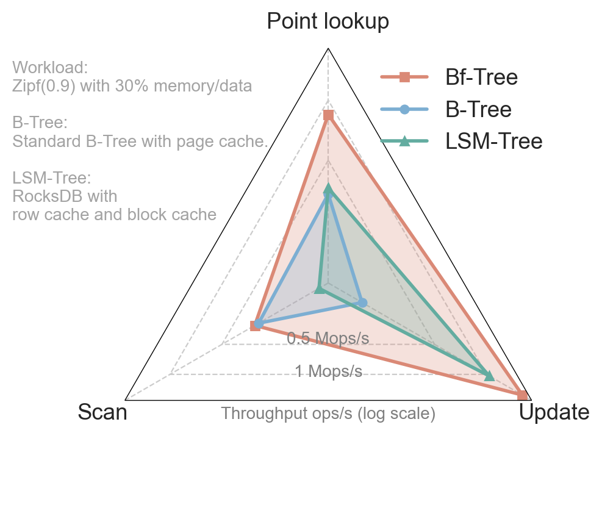

# Bf-Tree materials

Bf-Tree is a modern B-Tree that is read-write-optimized by building a new variable-length buffer pool to manage such cache pages, called mini-pages. 

Bf-Tree uses this in-memory buffer pool to support efficient record-level caching, buffering recent updates, caching range gaps, as well as mirrors of disk pages when needed. 

We implement a fully featured and modern Bf-Tree in Rust with 13k lines of code, and show that Bf-Tree is **2.5× faster than RocksDB (LSM-Tree) for scan operations, 6× faster than a B-Tree for write operations, and 2× faster than both B-Trees and LSM-Trees for point lookup**. 

We believe these results firmly establish a new standard for database storage engines of the future.

## Show me the code!

Unfortunately Bf-Tree code is not open-sourced yet due to IP issues.
I've tried my best to get the permission ~~(but the hope is not high imo)~~.

With that said, I've prepared the code in a way that it is ready to be open-sourced and will publish to crates.io once I get the permission.

## Can I re-implement Bf-Tree?

Yes! I believe you can implement a very similar Bf-Tree with the information in the paper.

If you encounter any problems or have questions about implementation details, I'm more than happy to help you out and give you some hints!

As an estimation of the effort,
my implementation takes 13k lines of code in Rust, and I believe 
it is unlikely to be less than 10k loc in any language.

## Is Bf-Tree deployed in production?

No. The prototype I implemented is not deployed in production yet.

However, the circular buffer pool design is very similar to FASTER's hybrid log, which is deployed in production at Microsoft. 

## What are the drawbacks of Bf-Tree?

- Bf-Tree only works for modern SSDs where parallel random 4KB writes have similar throughput to sequential writes. While not all SSDs have this property, it is not uncommon for modern SSDs.

- Bf-Tree is heavily optimized for small records (e.g., 100 bytes, a common size when used as secondary indexes). Large records will have a similar performance to B-Trees or LSM-Trees.

- Bf-Tree's buffer pool is more complex than B-Tree and LSM-Trees, as it needs to handle variable length mini-pages. But it is simpler than Bw-Tree in my opinion, which is implemented & deployed in production.

## I got questions!

Feel free to reach out to me at xiangpeng.hao@wisc.edu or open an issue here.

## List of files

- `paper.pdf`: The VLDB paper. We continuously fix the errors/typos in the paper, and we keep the paper.pdf updated.

- `slides-vldb.pptx`: The slides used in VLDB 2024, Guangzhou, China. 

- `poster-vldb.pdf`: The poster used in VLDB 2024.

## Errata

Some notable changes:

- We have fixed a legend typo in Figure 1.
